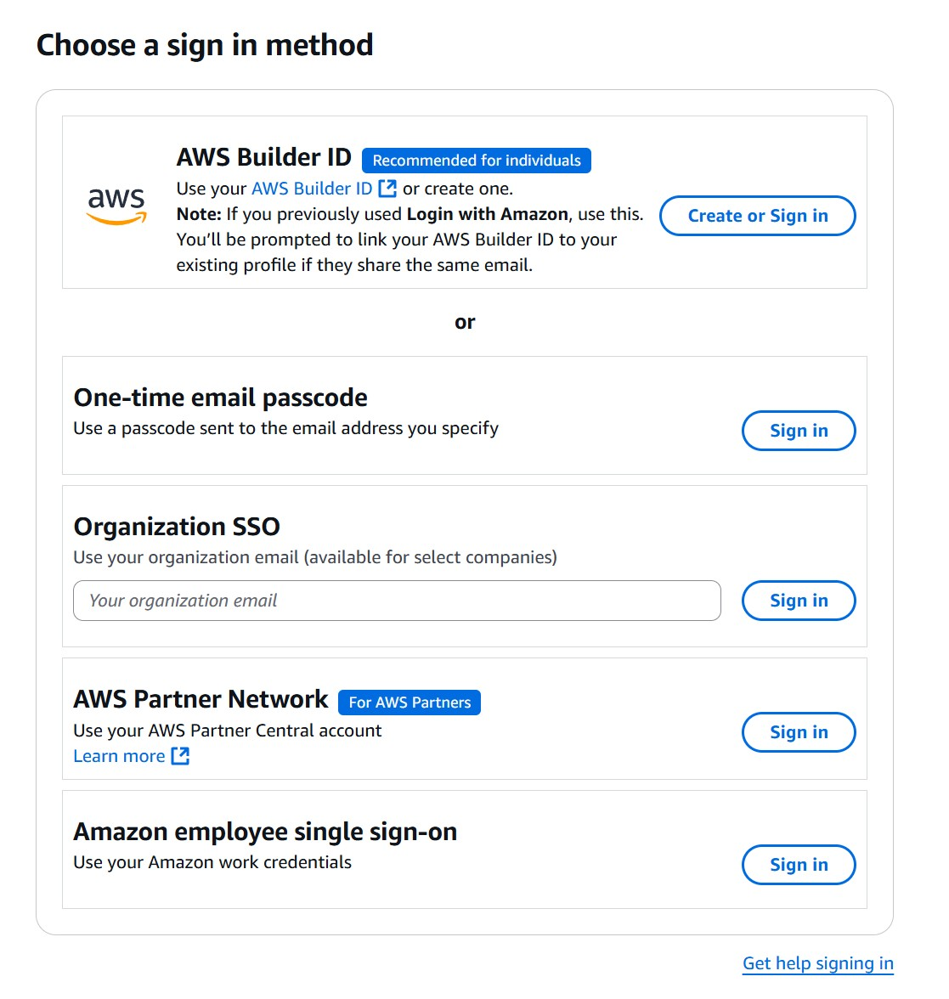

# EKS-Outubro-2025

# Links gerais 
- [Acesso ao laboratório e material do curso](https://us-east-1.student.classrooms.aws.training/class/ilt%231pWJYGQTTKKbuzRHBCWUww). Ao abrir este link, você verá uma tela para fazer login, parecida com a tela abaixo  Você deve fazer login com o mesmo email usado para registrar-se no curso. 
A forma tipicamente recomendada para login é usando o "builder id". O problema é que normalmente este funciona apenas com emails pessoais. Se você se registrou com a sua conta corporativa, escolha "One-time email passcode". Caso este não funcione (por exemplo, por bloqueio no seu servidor de email), utilize "Organization SSO". A opção de SSO talvez te impeça de realizar os labs corretamente. Uma vez que você esteja registrado, pode ser que receba um "acesso negado". Me avise, que acrescento o email que você está utilizando à classe.
- [Skill Builder, plataforma bastante completa de cursos gratuitos](https://skillbuilder.aws/)

# Cursos interessantes como pré-requisitos:
- [EKS Primer](https://skillbuilder.aws/learn/Z521GMBP1J/amazon-eks-primer/NGM5AF9K72)
- [AWS Cloud Practitioner Essentials](https://skillbuilder.aws/learn/94T2BEN85A/aws-cloud-practitioner-essentials/8D79F3AVR7)
- [Introduction to containers](https://skillbuilder.aws/learn/CUCA1DK47V/introduction-to-containers/XJ58VC1FF5)

# Links do dia 1
- [12 factor app](https://12factor.net/)
- [There's no place like production](https://imwrightshardcode.com/2010/12/theres-no-place-like-production/)
- [10+ deploys per day at Flicks - video que meio que dá origem ao termo DevOps](https://www.youtube.com/watch?v=LdOe18KhtT4)
- [The Phoenix project](https://www.amazon.com.br/Phoenix-Project-Gene-Kim/dp/1950508943)
- [The unicorn project](https://www.amazon.com.br/Unicorn-Project-Developers-Disruption-Thriving-ebook/dp/B082XJPDBB)
- [The DevOps Handbook](https://www.amazon.com.br/DevOps-Handbook-World-Class-Reliability-Organizations-ebook/dp/B09G2GS39R)
- [Accelerate: The Science of Lean Software and DevOps: Building and Scaling High Performing Technology Organizations](https://www.amazon.com.br/Accelerate-Software-Performing-Technology-Organizations/dp/1942788339/)
- [Artigo publicado no IEEE ICC 2019, comparando plataformas de orquestração de containers](https://isamaljawarneh.github.io/pubs/ICC19.pdf)
- [CNCF Landscape, panorama dos projetos "reconhecidos" pela Cloud Native Computing Foundation](https://landscape.cncf.io/)`
- [Arquitetura de Kubernetes](https://kubernetes.io/docs/concepts/architecture/)
- [Kubeadm, ferramenta principal para configuração de um cluster](https://kubernetes.io/docs/setup/production-environment/tools/kubeadm/)
- [Kubernetes the hard way](github.com/kelseyhightower/kubernetes-the-hard-way)
- [Taints and tolerations](https://kubernetes.io/docs/concepts/scheduling-eviction/taint-and-toleration/)
- [Criterios de afinidade de pod](https://kubernetes.io/docs/concepts/scheduling-eviction/assign-pod-node/#affinity-and-anti-affinity)
- [Tipos de workloads no kubernetes](https://kubernetes.io/docs/concepts/workloads/controllers/)
- [Estrutura de um deploymentspec, atenção aos parâmetros maxUnavailable e maxSurge](https://v1-32.docs.kubernetes.io/docs/concepts/workloads/controllers/deployment/#writing-a-deployment-spec) 
- [Operators, um bom padrão para extensão da API](https://www.cncf.io/blog/2022/06/15/kubernetes-operators-what-are-they-some-examples/)
- [Repositório de operators](https://operatorhub.io/)
- [Exemplo bem simples de Custom Resource Definition](https://kubernetes.io/docs/concepts/extend-kubernetes/api-extension/custom-resources/)
- [Opções de compute plane em EKS - Fargate, self-managed, EKS-managed](https://docs.aws.amazon.com/eks/latest/userguide/eks-compute.html)
- [Resolução de erros em clusters e nós](https://docs.aws.amazon.com/eks/latest/userguide/troubleshooting.html) 
- [Admission controllers no Kubernetes](https://kubernetes.io/docs/reference/access-authn-authz/admission-controllers/)
- [Criação de perfies de Fargate via CLI](https://docs.aws.amazon.com/cli/latest/reference/eks/create-fargate-profile.html)
- [EKS auto-mode](https://docs.aws.amazon.com/eks/latest/userguide/automode.html)
- [Nós híbridos em EKS - possibilidade de instalação on-premises](https://docs.aws.amazon.com/eks/latest/userguide/hybrid-nodes-overview.html)
- [Documentação do eksctl](https://docs.aws.amazon.com/eks/latest/eksctl/what-is-eksctl.html)
- [Repo do eksctl](https://github.com/eksctl-io/eksctl)